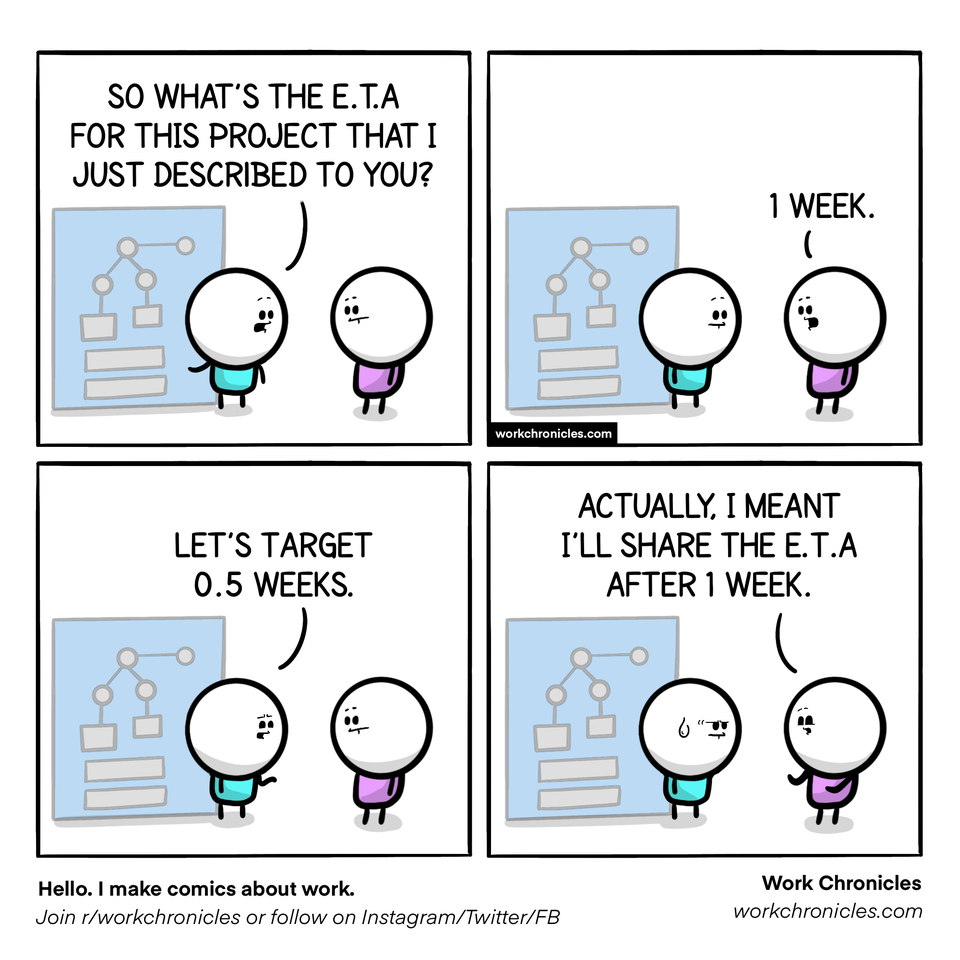

# Chapter 1: DevOps

Let's talk about DevOps. DevOps is primarily about continuously learning and improving. It's ok to make mistakes, but let's automate what we can and not make the same mistake twice. DevOps is not a tool, or a process, DevOps is a movement of behaviours and culture that encourage postive progress and continuous delivery of value to end users.

**You need to adapt your organization/processes to DevOps.** Don't think that you can adopt DevOps to your processes. More often than not, that leads to transformation failure.  

DevOps can work everywhere. Sometimes teams say "that wouldn't work here". That is rubbish. You have to imagine "what if", and you can get there. If Microsoft can manage this massive change, any organization can. Companies producing medical devices, software for hardware, and other applications that wouldn't typically continually release software - DevOps can still work for them. It's not about continually delivering software, it's about being **able to**.

## Culture
The most important part of DevOps. Main points: 
1. Take the science seriously, but don't be overly prescriptive
2. Stop celebrating activity, start celebrating results
3. You cannot cheat shipping
4. Build the culture you want, and you'll get the behavior you're after

## What not to do

- If you think you can adopt DevOps with a new tool, you will be disappointed.
- If you think you can change the whole organization by yourself, you will have a bad time
- If you think you can do DevOps without executive support, you will fail
- If you think you can solve DevOps by adding a new "DevOps engineer" to your team, you will fail
- By very careful  measuring your teams progress and effectiveness with metrics, especially lines of code or velocity.
- If you think you can adopt DevOps without any organizational or cultural changes, you will fail, and of course, it's DevOps fault

## What do to
- Learn from your mistakes - and don't blame people for the mistakes, use them as constructive learning opportunities
- Practice "good enough". Your automated tests don't have to be perfect, they need to be 'good enough', and if a piece fails - that is where we invest more
- Focus on what hurts the most: What is not automated and could be? What should be running with automation but isn't working? What automation is not reliable?
- Not everyone needs DevOps nirvana. Some projects just need CI/CD. On the other hand, some applications are strategic and need continuous delivery and SRE and should strive for DevOps Nirvana. 

## The biggest mistakes people take with DevOps?
- Their automated testing is not comprehensive, there is no strategy and/or there are no unit tests
- Dev/Sandbox/QA/Test/Staging/Alpha/Beta/Pre-prod/Prod are not identical and not managed with code. If the non-production environments don't match production, you have no way of confirming if the change will work or not
- No feature flags. Mistakes happen, even in the best teams. Mistakes are ok - but how quickly can you recover? Feature flags really help with this. 
- Storing secrets in repositories

## Automated testing
Automated testing is usually the first challenge in implementing DevOps. Resistance is common from the QA manager/team, who misunderstand that the point of automation is not to replace their jobs - it's to replace the long regression testing phases. QA can now focus on the latest changes, and be confident that their previous changes are being tested.

With proper automated testing and a well balanced test pyramid, (no, functional tests are not the first stop, start with your mocked unit tests first), an entire regression test can be run quickly (measured in minutes, not days). You will get this wrong - a lot. That is ok, and is why we track the core DevOps metric "Change failure rate". When we find something we missed (and again, this is the role of everyone on the team, not just QA), create a new test that covers that scenario.

## Database DevOps
Number 2 issue is data. Database DevOps is hard, as you fundamentally have to change the way you think about managing data. The crux of this comes down to the concept of destructive and non-destructive changes.

- A destructive change is anything that changes a column or table name or type. 
- A non-destructive change is anything additive, adding a new column or table - that does not affect the rest of the database. Note: This assumes that the team is not using "SELECT \*" statements. 

Essentially you want to avoid destructive changes as much as possible. This is hard for DBA's, as the implication is that the focus changes from performance and a 'clean' database schema, to performance and uptime. For example, editing a column name is forbidden. Instead, you should add a new column and a migration from one column to another. Your consuming service only needs to use the new column.

## Infrastructure as Code
Number 3 is Infrastructure as Code. This is where the cloud comes in. Having your entire environment be scriptable is key to meeting one of the DevOps core high performing metrics, Mean Time To Restore (MTTR). This also allows you to create new test environments easily. This isn't always about containers (we will talk about these in a another chapter).

It doesn't matter what tool you use. ARM templates, Terraform, PowerShell - it really doesn't matter - but don't fool yourself that using Terraform will make you instantly multi-cloud.

## Feature Flags/Toggles
Not always recognized a being critical to DevOps - but if you want to continually deploy to production, you can't do this without Feature Flags. Feature Flags also help to battle environment sprawl. Have 5-7 environments? (Dev, intergration, test, qa, staging, prod?) Why? What do those middle layers give you? It's like adding 3 different types of lettece in a sandwich - the resulting sandwich is not better or worse. With Feature Flags you can release more WIP into production with the feature disabled for the majority of users. This means we need less environments - which helps with another core DevOps metric: Lead Time For Changes.

## Agile methodology
SaFE is not Agile. Agile is not about planning out the next 3 months in detail. Being able to change your mind anytime you like, is not Agile. 

Agile is about planning to deliver small pieces of work within a spring, that can be adapted, adjusted, and reassessed after each sprint. Agile is about continuously learning. 

## Handling aborted DevOps transformations. 
Sometimes DevOps doesn't work out. It's usually because of a misunderstanding of DevOps - perhaps that a tool can enable DevOps, or that the organization doesn't have to transform to adopt it. This typically leaves teams feeling like it doesn't work, "I tried unit tests, it didn't work for us". 

**To reboot, some need ‘alternative language’ to enable transformation**. Words such as Agile, DevOps, Unit tests, etc are loaded and many have perceived (and incorrect) ideas about what they are, and have tried to implement them and failed. “We tried unit tests and agile, but it didn’t work for us”. Using different language enables them to try again. Instead of unit tests, L0-L3 tests. Instead of Agile and User Stories, use Scrum and Product Backlog items. It’s subtle, but enough for organizations to redefine these processes and start with a new definition that puts everyone on the same page and removes assumptions.

## Continuous Integration
Small changes, with short lived branches to reduce complexity. Your work will be verified with automated tests - ensuring quality. This is where a lot of people make their branching too complicated for no reasons they can really explain, other than, "this is how we do it". This is also where I see the most intense "holy wars" - branching dicussions are NOT fun.

## Continuous Deployment
You don't have to release continuously, but you have to be able to release at anytime. This is an indication that you are ready and can deploy code.

## Getting started
See the [checklist in the appendix](99-Appendix-DevOpsStartUpList.md)

